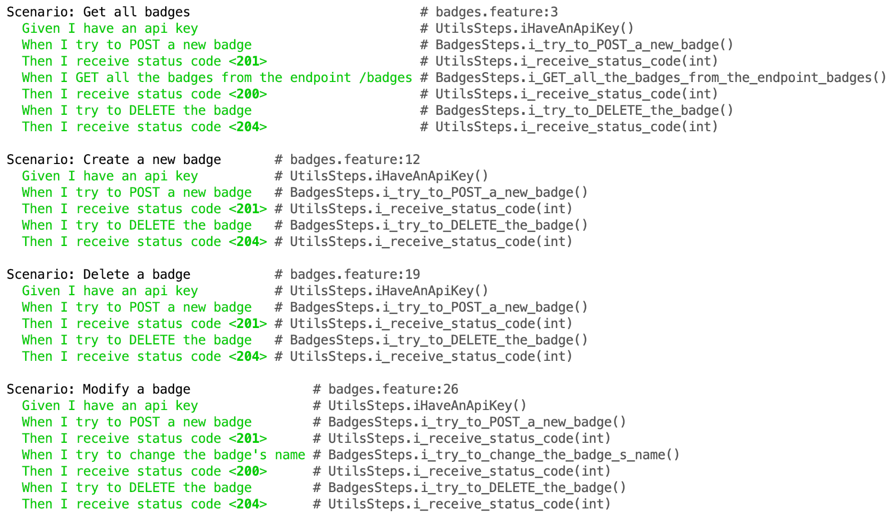

# Tests cucumber

Ce document présente les tests que nous avons réalisés sur notre application. 

## Prérequis

Afin d'exécuter les tests sur notre application, il faut les prérequis suivants:

#### Sans docker

- Avoir un serveur MySQL qui tourne
  - La string de connexion est présente dans le fichier ` application.properties` dans le dossier Ressources.
- Avoir créé une application ayant l'api key "a1"
  - ` INSERT INTO application (name, description, app_key, app_token, enabled) VALUES('a1', 'a1', 'a1', 'a1', true);`
- Exécuter le serveur Spring

#### Avec docker

- Aller dans le répertoire docker du projet et lancer la commande ` docker compose up`

## Exécuter les tests

Afin d'exécuter les tests, ouvrir le projet : ` cucumber-tests` et exécuter les tests via la class ` SpecificationTest`.

Nous avons décidé de créer des tests pour chaque fonctionnalités et ceci sans avoir de restes dans la base de données. C'est pour cela que les tests sont certaines fois redondants.